# Football Hero 
## Project Description
This app will allow user to checkout his favorites soccer player of all time. Now, if you think the site doesnt have your favorite player(s), Football Hero has a feature that allows you to upload your favorite player picture and other relevant information (nationality, teams, position, etc).
## Figma

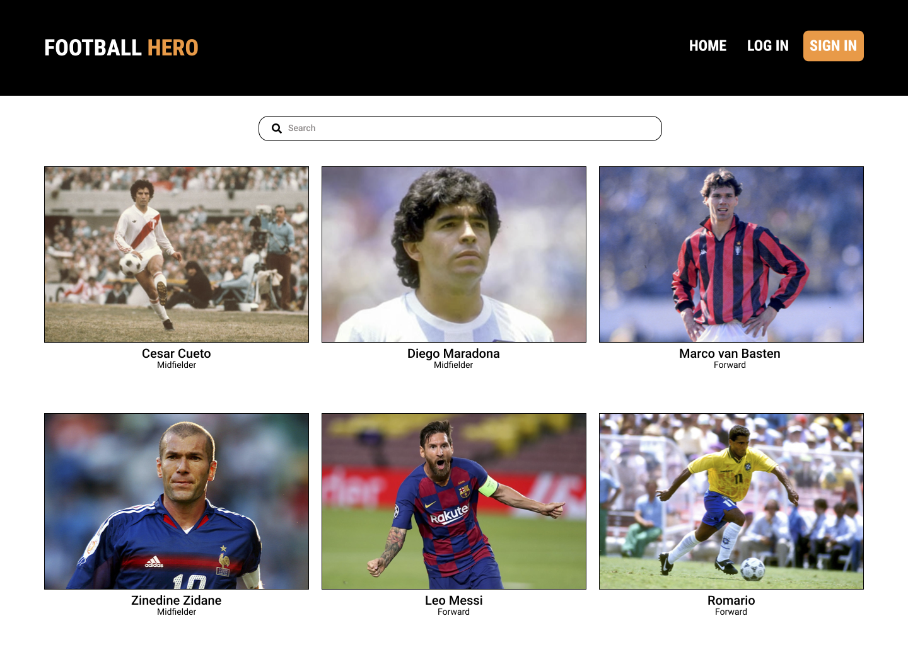

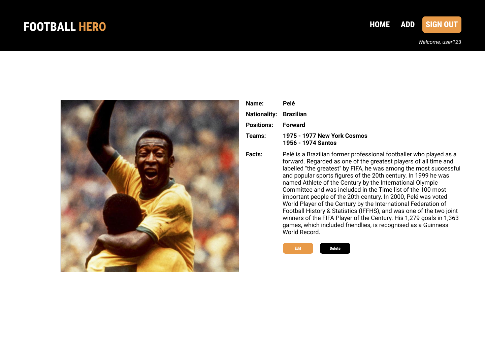

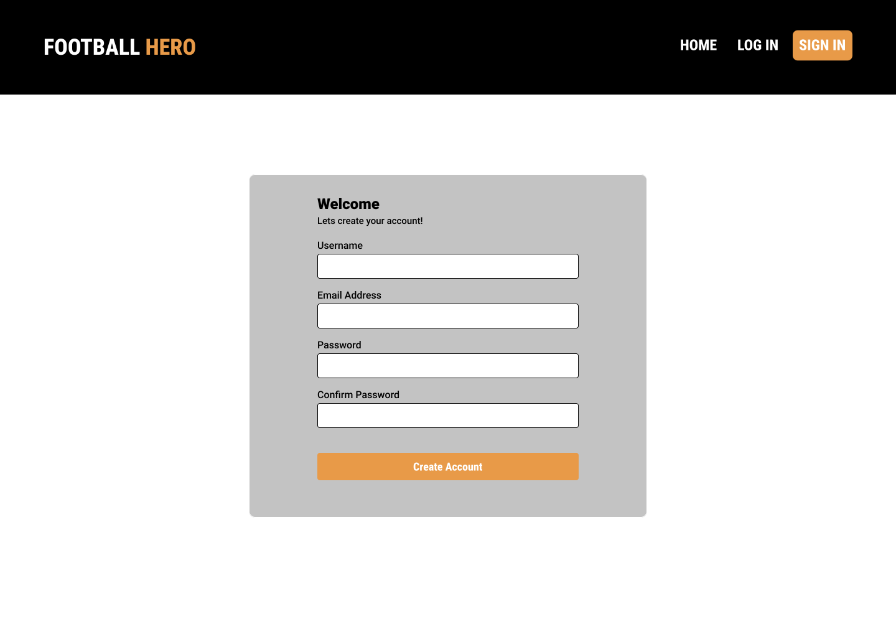

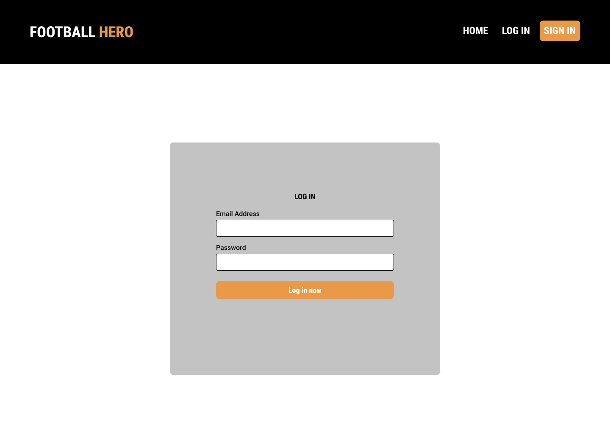

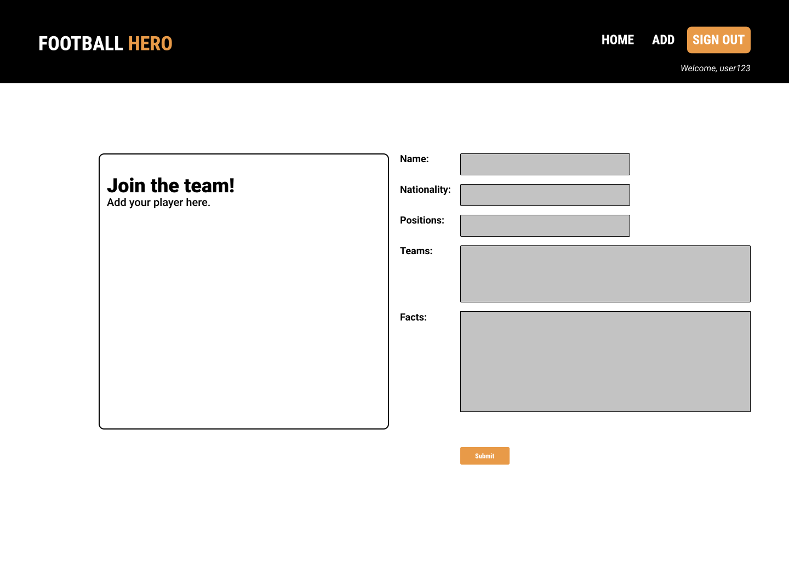

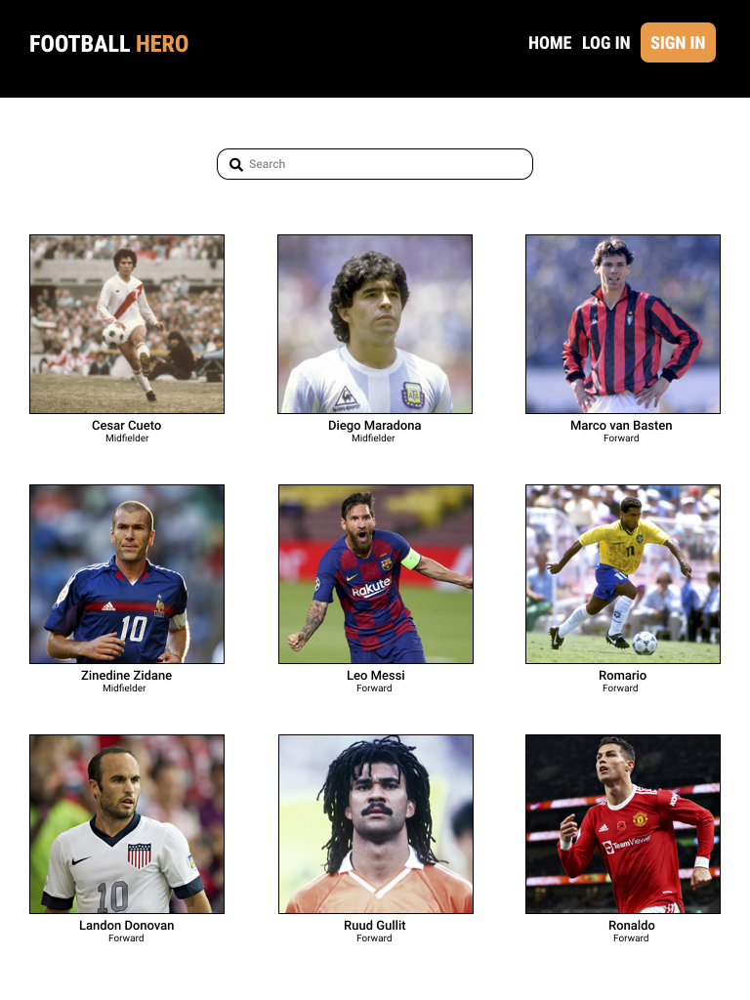

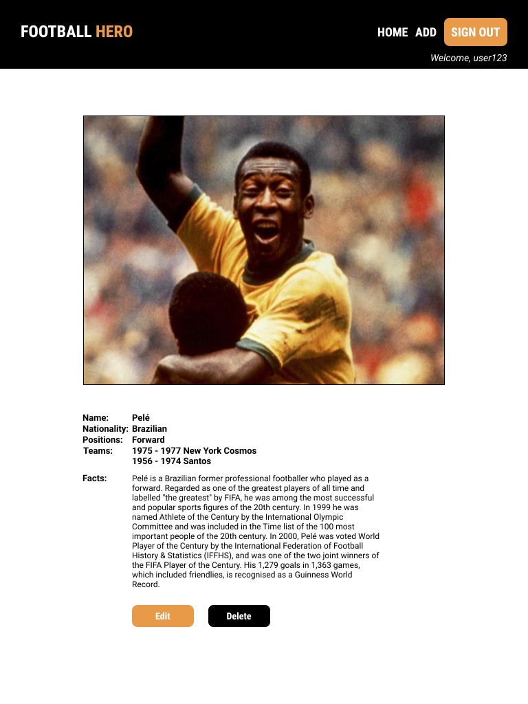

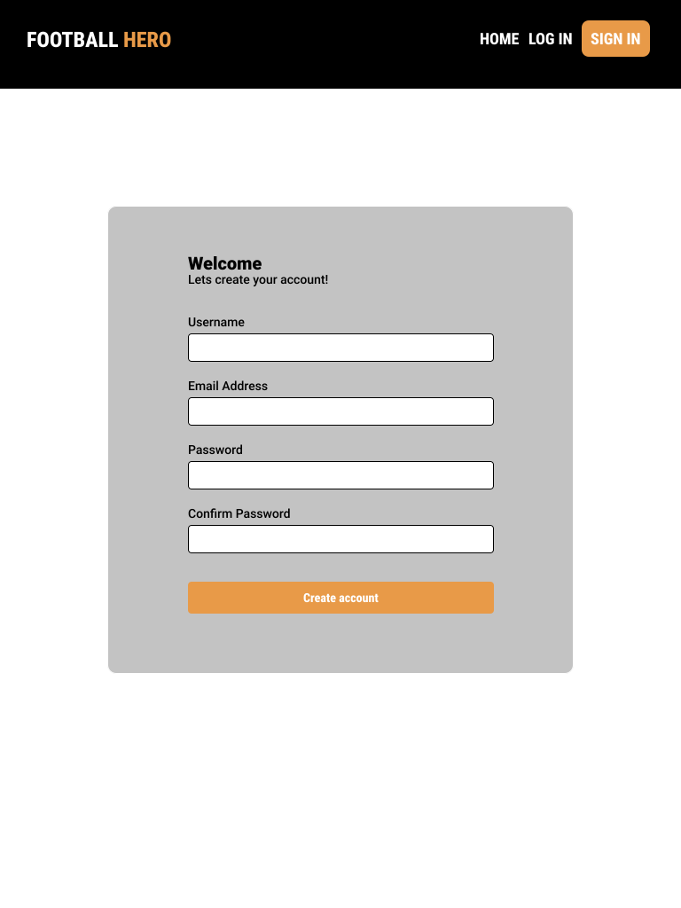

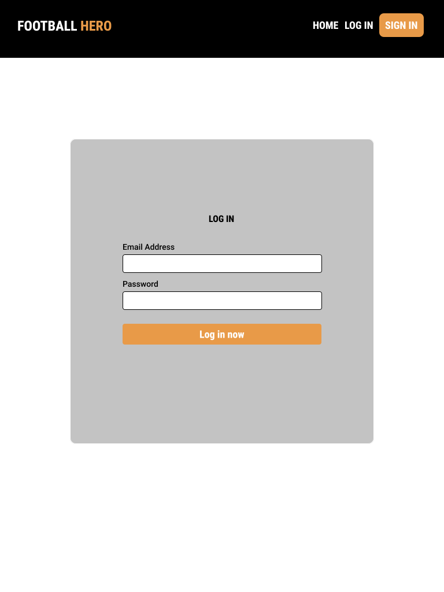

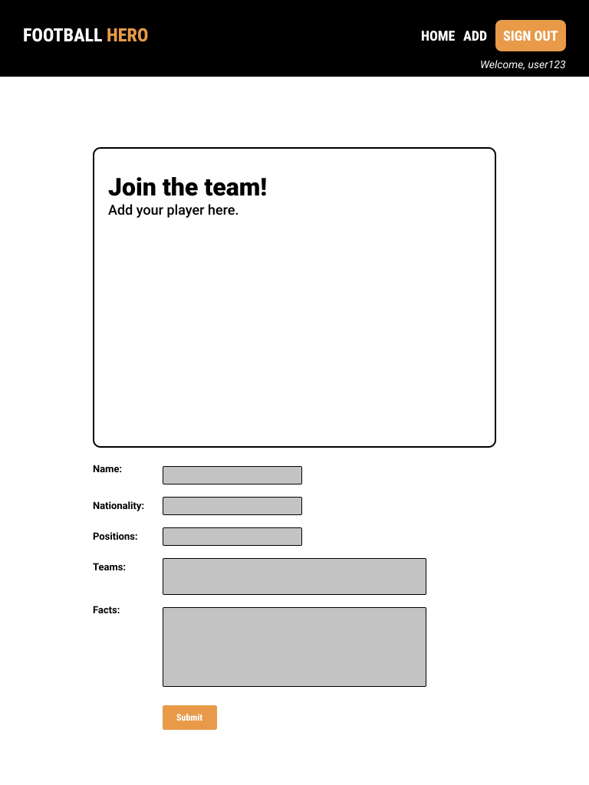

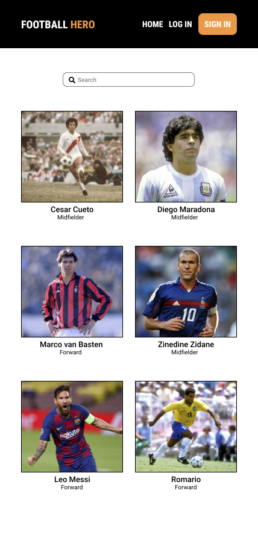

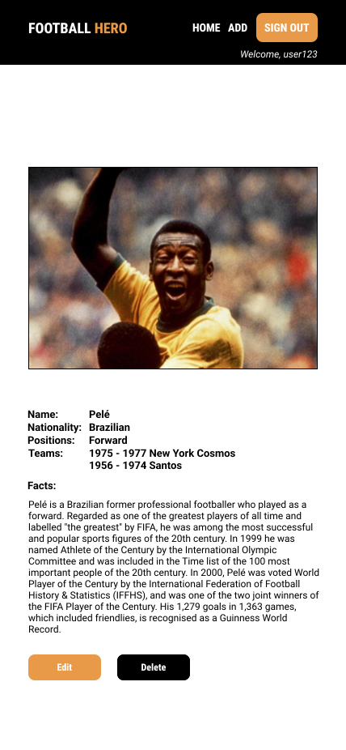

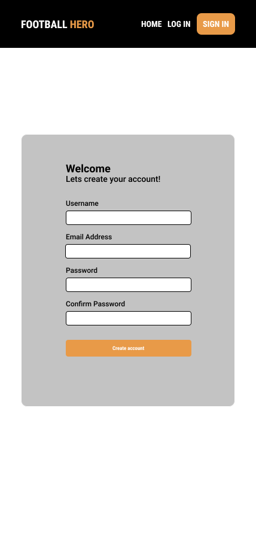

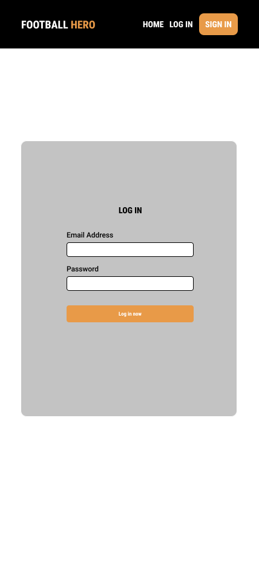

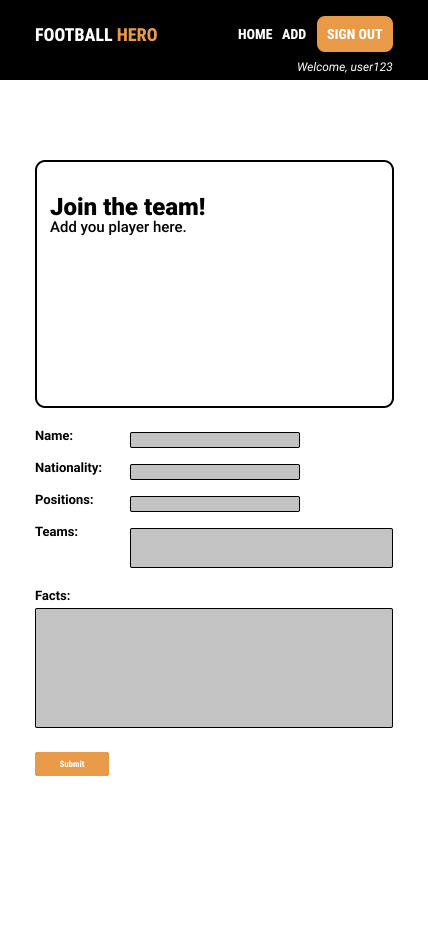

## Schema

## MVPs
- Full CRUD capacity backend (Express, Mongoose, MongoDb).
- Full CRUD capacity React frontend (detail screen, listing screen, create screen).
- Responsive design (desktop, tablet and mobile).
- User Sign Up/In authentication. 
- 
## PMVPs
- Landing page.
- Hamburger menu.
- User interaction: comments and reviews.
- Consumer user account and login.
- Testing.
